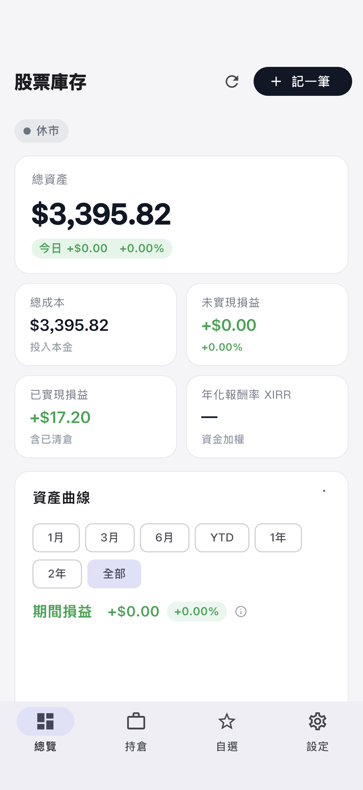
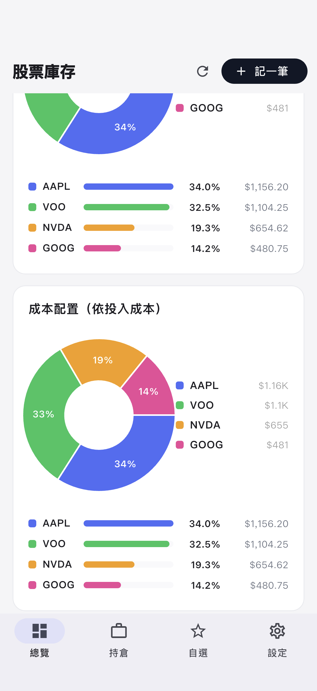
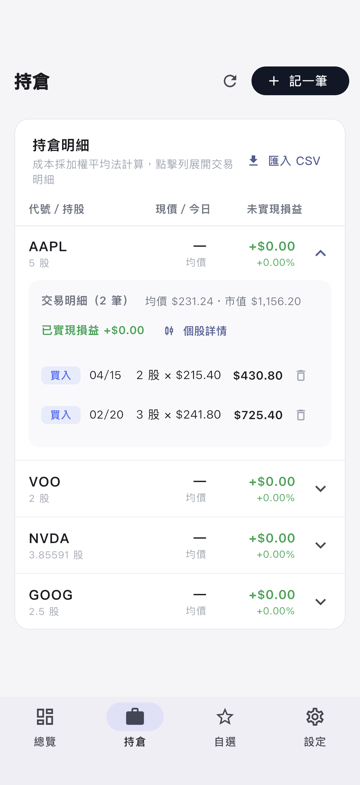
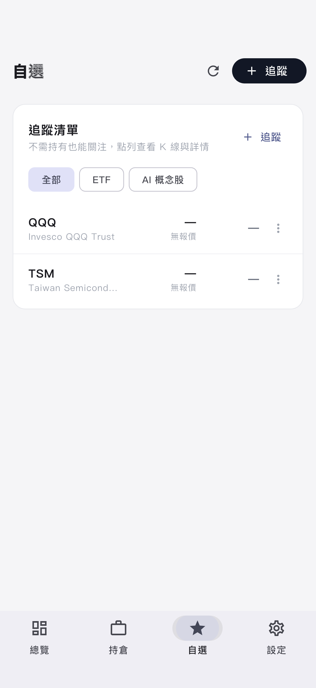

# 股票庫存管理 App

免費、開源的個人美股庫存管理 App，定位介於「記帳軟體」與「投資組合追蹤器」之間。
匯入券商交易紀錄（或手動記帳）後，自動計算持倉、抓取即時報價，並以圖表呈現資產狀況。

以 Flutter 開發，單一程式碼庫支援 **macOS / Windows / Linux / iOS / Android / 網頁版**。

> 🌐 **線上版（免安裝）**：https://stock-portfolio-3ba.pages.dev
>
> ✅ 不需要申請任何 API Key　✅ 沒有訂閱費　✅ 資料全部存在你自己的裝置上，沒有雲端後端

| 總覽 | 配置分析 | 持倉明細 | 自選追蹤 |
|---|---|---|---|
|  |  |  |  |

## 功能總覽

- **記帳**：CSV 匯入（自動去重）＋手動記帳（代號搜尋自動完成、預帶現價、碎股）
- **持倉損益**：加權平均成本、未實現/已實現損益、今日損益、XIRR 年化報酬率
- **即時報價**：盤前／盤中／盤後三時段，依美東時間自動調整更新頻率，離線顯示快取
- **圖表**：資產曲線（時間範圍＋期間損益＋大盤比較）、市值/成本雙圓餅圖＋配置明細條
- **個股詳情**：日/週/月 K 線（可縮放平移）、成交量、52 週高低、市值、本益比、相關新聞
- **自選追蹤**：不需持有也能關注，支援自訂分類
- **股息追蹤**（選用）：依除息日持股計算累計股息
- **跨裝置**：匯出/匯入備份（合併模式＋刪除墓碑，不會蓋資料也不會讓刪掉的紀錄復活）
- **外觀**：深淺主題、漲跌配色（美股慣例/台股慣例）切換

---

# 安裝

## 方法一：線上版（最快）

直接開 **https://stock-portfolio-3ba.pages.dev** ，桌機、手機瀏覽器都可以。
資料存在該瀏覽器的本機儲存空間；換裝置請用「匯出備份 → 匯入備份」搬資料。

## 方法二：下載安裝檔

到 [Releases 頁面](https://github.com/wythe5774133/stock_portfolio_app/releases) 下載對應平台的檔案：

| 平台 | 檔案 | 安裝方式 |
|---|---|---|
| macOS | `StockPortfolio-macOS-*.zip` | 解壓縮後把 App 拖進「應用程式」。第一次開啟請對 App **按右鍵 → 打開**（App 未經 Apple 公證會出現警告）；若仍無法開啟，終端機執行 `xattr -cr /Applications/stock_portfolio_app.app` |
| Windows | `StockPortfolio-Windows-*.zip` | 解壓縮到任意資料夾，執行 `stock_portfolio_app.exe`（SmartScreen 警告點「其他資訊 → 仍要執行」） |
| Linux | `StockPortfolio-Linux-*.tar.gz` | 解壓縮後執行 `bundle/stock_portfolio_app` |
| Android | `StockPortfolio-Android-*.apk` | 傳到手機點開安裝，需允許「安裝未知的應用程式」 |
| iOS | 無安裝檔 | Apple 簽章限制，請用「從原始碼建置」一節側載 |

## 方法三：從原始碼建置

<details>
<summary>展開建置步驟（開發者用）</summary>

### 共同步驟

安裝 [Flutter SDK](https://docs.flutter.dev/get-started/install) 3.44 以上，然後：

```bash
git clone https://github.com/wythe5774133/stock_portfolio_app.git
cd stock_portfolio_app
flutter pub get
dart run build_runner build --delete-conflicting-outputs
```

### 各平台

```bash
flutter build macos --release    # 需 Xcode，產物在 build/macos/Build/Products/Release/
flutter build windows --release  # 需 Visual Studio C++ 工作負載
flutter build linux --release    # 需 clang cmake ninja-build libgtk-3-dev
flutter build apk --release      # 需 Android Studio / SDK
flutter build web --release      # 網頁版，見下方「部署自己的網頁版」
```

### iOS 側載（免開發者年費）

1. `open ios/Runner.xcworkspace`，在 Signing & Capabilities 選你的 Apple ID 作為 Team，
   Bundle Identifier 改成唯一字串
2. iPhone 接上 Mac，`flutter run --release -d <裝置>`
3. 手機「設定 → 一般 → VPN 與裝置管理」信任你的憑證
4. 免費 Apple ID 簽署的 App 每 7 天需重裝一次

</details>

---

# 使用教學

## 第一步：把交易資料弄進來

### 方式 A：手動記帳（推薦新手）

1. 點右上角「**＋ 記一筆**」
2. 在「股票代號」欄輸入代號或公司名稱（例如 `NVDA` 或 `台積電`），會跳出建議清單——美股、台股（`2330.TW`）、ETF 都搜得到
3. 點選正確的股票後，**價格會自動帶入目前市價**（歷史交易請自行改成當時成交價）
4. 選「買入」或「賣出」、輸入股數（支援 `0.5`、`0.77129` 這類碎股）、選交易日期（預設今天）
5. 按「儲存」——持倉、損益、圖表立即更新

把過去的每一筆買賣都記進來，App 會自動算出正確的平均成本與損益。

### 方式 B：匯入 CSV（適合交易筆數多）

支援 **Yahoo Finance 投資組合匯出格式**。取得方式：

1. 到 [finance.yahoo.com](https://finance.yahoo.com) 登入，建立 Portfolio 並把你的交易（含買賣日期、價格、股數）記錄進去
2. Portfolio 頁面 → **Export** 下載 CSV
3. 回到 App：「持倉」分頁右上角（或「設定 → 匯入交易 CSV」）選擇該檔案

CSV 欄位格式如下（App 只讀取交易相關欄位，其餘忽略）：

```csv
Symbol,Current Price,Date,Time,Change,Open,High,Low,Volume,Trade Date,Purchase Price,Quantity,Commission,High Limit,Low Limit,Comment,Transaction Type
NVDA,210.96,2026/07/10,16:00 EDT,8.18,201.92,211.0,201.92,147203662,20260707,194.478914,0.77129,,,,,BUY
```

- 讀取欄位：**Symbol** 代號、**Trade Date** 交易日（`20260707`）、**Purchase Price** 成交價、**Quantity** 股數、**Transaction Type**（`BUY`/`SELL`）
- **同一份 CSV 重複匯入不會產生重複交易**（以代號＋日期＋價格＋股數＋類型去重），放心多次匯入
- 格式錯誤的列會自動跳過並告訴你跳過了幾列，不會整批失敗

## 看懂總覽頁

| 卡片 | 意義 |
|---|---|
| **總資產** | 目前持股的總市值（含今日漲跌金額與 %） |
| **總成本** | 還在手上的部位投入的本金（加權平均法） |
| **未實現損益** | 總資產 − 總成本：帳面賺賠 |
| **已實現損益** | 歷來賣出實際落袋的賺賠（含已清倉股票） |
| **累計股息** | 開啟股息追蹤後顯示，依除息日當時持股計算 |
| **年化報酬率 XIRR** | 資金加權年化：你的錢實際成長速度（資料滿 30 天才顯示） |

**資產曲線**：藍色實線＝總市值、灰色虛線＝總成本，由你的交易紀錄＋歷史股價逐日重建。

- 上方膠囊切換時間範圍（1月～全部）
- **期間損益**＝期末市值 − 期初市值 − 期間新投入的本金（**加碼的錢不會被誤算成獲利**）
- 下方勾選 **S&P 500／那斯達克／台灣加權** 會切換成報酬率%比較模式：所有線從期初歸零，直接看你有沒有跑贏大盤（時間加權法 TWR）

⚠️ 三種損益角度不同，數字本來就不一樣：未實現損益是「成本觀點」、期間損益/大盤比較是「時間加權」、XIRR 是「資金加權年化」。

## 持倉頁

- 每列顯示：代號/持股、現價（含今日漲跌%）、未實現損益
- **點擊任一列展開**：逐筆交易明細（買/賣、日期、價格、金額）、該股已實現損益、均價與市值
- 明細裡每筆交易右側的 🗑 可**刪除交易**（有確認框，刪除後全部重算）
- 「個股詳情」按鈕進入 K 線頁

## 自選頁（追蹤清單）

- 右上「＋ 追蹤」搜尋任何股票加入，**不需要持有**
- 加入時可選**分類**（例如「AI 概念股」「ETF」），清單頂部用分類籤快速過濾
- 每列的 ⋮ 選單：更改分類／移除追蹤
- 點任一列進入個股詳情

## 個股詳情頁

- **K 線圖**：日K／週K／月K 切換，第二排選時間範圍（日K 3月～1年、月K 5年～全部）
- **縮放平移**：手機捏合縮放、拖曳平移；電腦滾輪/觸控板縮放；**雙擊還原**
- 持有的股票會有一條**藍色水平線標示你的平均成本**，一眼看出現價離成本多遠
- 下方依序：成交量圖、開高低收/52週高低/市值/本益比、你的持倉摘要、**相關新聞**（點擊開原文）

## 股息追蹤（設定 → 資料）

預設**關閉**。是否開啟取決於你的券商設定：

- 券商有開**股息再投資（DRIP）**（如 Firstrade 可選）：股息已變成碎股買入出現在交易紀錄裡 → **保持關閉**，否則股息會被重複計算
- 股息**現金入帳**（如國泰複委託）：**開啟**，App 自動抓歷史配息、依除息日持股計算累計股息，XIRR 也會計入

## 跨裝置搬資料／備份

1. 舊裝置：「設定 → **匯出備份**」→ 桌面版存檔、手機版開分享面板（存到檔案/AirDrop/雲端）
2. 新裝置：「設定 → **匯入備份**」選擇該檔案

匯入採**合併模式**：不會蓋掉現有資料、重複交易自動略過、**刪除過的紀錄不會復活**（內建刪除墓碑機制）。兩台裝置各自記帳後互相匯入即可雙向補齊。建議定期匯出備份保存。

## 外觀

「設定 → 外觀」：

- **背景深淺**：淺色／深色／跟隨系統
- **漲跌配色**：漲綠跌紅（美股慣例）／漲紅跌綠（台股慣例），影響所有損益數字與 K 線顏色

---

# 常見問題

**Q：報價是即時的嗎？**
來自 Yahoo Finance 非官方端點，有數秒延遲。畫面上會標示目前時段（盤前/盤中/盤後/休市）與「最後更新於 X 分鐘前」。盤中每 45 秒自動更新、盤前盤後 3 分鐘、休市停止。

**Q：顯示「報價暫時無法取得」？**
Yahoo 偶爾限流，App 會自動退避重試並先顯示快取價格，稍等即可。

**Q：我的交易資料會上傳到哪裡？**
哪裡都不會。桌面/手機版存本機 SQLite、網頁版存瀏覽器儲存空間，這個專案沒有任何伺服器收你的資料（網頁版報價經過的 Cloudflare Worker 只轉發報價請求，不經手你的持倉）。

**Q：成本是怎麼算的？**
加權平均法：賣出時以當下平均成本認列已實現損益，平均成本不變；全部賣光後歸零重算。

**Q：支援台股嗎？**
可以記帳與追蹤（代號如 `2330.TW`），報價與 K 線都有。時段判斷目前以美股（美東時間）為準。

**Q：資料庫檔案在哪？**
macOS：`~/Library/Containers/com.wythe.stockPortfolioApp/Data/Documents/stock_portfolio.sqlite`；
Windows：`文件\stock_portfolio.sqlite`。備份這個檔案＝備份全部。

---

# 開發者

```bash
flutter test        # 99 個單元與 widget 測試
flutter analyze     # 靜態分析（零容忍）
dart run tool/quote_probe.dart    # 驗證 Yahoo 端點在目前網路可用
# UI 走查（iOS 模擬器四分頁截圖到 build/screenshots/）：
flutter drive --driver=test_driver/integration_test.dart \
  --target=integration_test/screenshot_walkthrough_test.dart -d <模擬器>
```

### 專案結構

```
lib/
├── models/      # 純資料類別（交易、持倉、報價、K線、新聞…）
├── database/    # drift + SQLite（schema v5：交易/報價快取/歷史價/配息/追蹤/墓碑）
├── services/    # CSV 解析、Yahoo 報價、搜尋、配息、備份、時段判斷、輪詢
│   └── platform_io/   # dart:io 與網頁的條件式實作
├── logic/       # 計算引擎（加權平均、TWR、XIRR）與 Repository（UI 唯一入口）
└── ui/          # 分頁式介面、圖表元件（fl_chart）、深淺主題
worker/          # Cloudflare Worker：網頁版的 Yahoo CORS 代理
.github/workflows/release.yml  # 推 v* 標籤自動建置四平台安裝檔
```

UI 與底層完全分離：畫面只透過 `PortfolioRepository` 取資料；底層正確性由單元測試保證（計算引擎的期望值全部手工推導驗證）。注意：`lib/` 內禁止 import `drift/native`（dart:ffi 會使網頁版建置失敗），測試請用 `test/test_database.dart`。

### 部署自己的網頁版（fork 的人看這裡）

網頁版需要一個 CORS 代理（瀏覽器不能直連 Yahoo）。用免費 Cloudflare 帳號：

```bash
cd worker && npx wrangler deploy        # 部署代理，記下網址
# 把 lib/services/yahoo_endpoints.dart 的 WEB_PROXY_BASE 預設值改成你的 Worker 網址
flutter build web --release
npx wrangler pages deploy build/web --project-name=<你的專案名>
```

### 發布新版本

```bash
git tag v1.1.0 && git push origin v1.1.0
```

GitHub Actions 會自動建置 macOS/Windows/Linux/Android 安裝檔並掛上 Release。

### 已知未完成

- Google Drive 自動同步：程式碼已在（`google_drive_sync_service.dart`＋墓碑合併），UI 已下架——自行編譯者需建立自己的 Google OAuth 憑證
- 台股交易時段判斷、到價提醒、年度已實現損益報表：規劃中

---

# 注意事項與授權

- 報價來自 Yahoo Finance 非官方端點，僅供參考，非投資下單依據
- 本 App 為個人記帳工具，不構成任何投資建議
- 授權：[MIT License](LICENSE) — 自由使用、修改、散布
